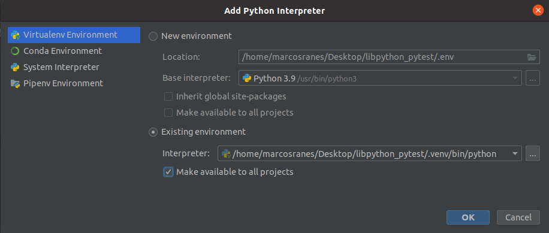

# libpython_pytest
How to set up effective Python tests With the PYTEST Library

We're going to use PIP, instead of PIPENV to start this project.

Summary:

## 1. Setting up the environment
### ` $ pyenv versions `
```shell
  system
  2.7.18
* 3.9.7 (set by /home/marcosranes/.pyenv/version)
```
### ` $ python -m venv .venv `
### ` $ . .venv/bin/activate `
```shell
(.venv) marcosranes@ubuntu21-vbox:~/Desktop/libpython_pytest$ 
```
### ` $ ls -la `
```shell
.  ..  .git  .gitignore  .idea  LICENSE  README.md  .venv
```
### ` Echoing command lines onto .gitignore `
```shell
(.venv) marcosranes@ubuntu21-vbox:~/Desktop/libpython_pytest$ echo "
> # Ignoring Pycharm Config
> .idea/
> " >> .gitignore
(.venv) marcosranes@ubuntu21-vbox:~/Desktop/libpython_pytest$ cat .gitignore | grep .ide
.idea/
(.venv) marcosranes@ubuntu21-vbox:~/Desktop/libpython_pytest$
```
### ` $ cat .gitignore | less `
```shell
...

# Ignoring Pycharm Config
.idea/
```
Note: Calling pipe less it comes with a Vim styled editor, so press q any time to quit, once you're satisfied.

## 2. Indexing a Python interpreter 


## 3. [Installing Flake8 linter and Pytest]
Before installing let's run the pip freeze command, just to show the dependencies, although we know we haven't installed dependencies yet.  
```shell
(.venv) marcosranes@ubuntu21-vbox:~/Desktop/libpython_pytest$ pip freeze
(.venv) marcosranes@ubuntu21-vbox:~/Desktop/libpython_pytest$ 
```
As we can see, nothing displayed above. So let's proceed to that [step-by-step](installing_flake8_and_pytest.md) in more detail.